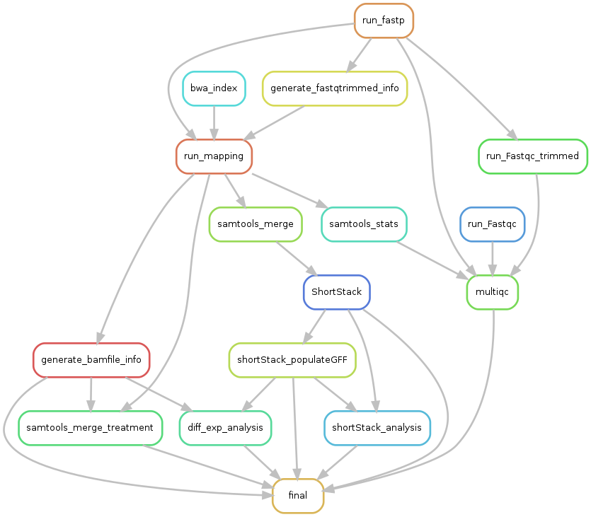

# sRNAmake

## Table of contents
1. [Introduction](#introduction)
2. [Prepare inputs](#config)
3. [Launch the pipeline](#launch)
4. [The outputs](#outputs)

## Introduction <a name="introduction"></a>:

sRNAmake is a pipeline of analyse of smallRNA using ShortStack and Deseq2.




## Prepare config.yaml <a name="config"></a>:

 - ### inputs :
 
``` 'DATA':
    'directories':
        'fastq_dir': "/path/to/directory/fastq"       # samples dir with fastq
        'out_dir': "/path/to/directory/output"       # Out director
    'files':
        'reference': "/path/to/file/ref.fasta"
        'annotation': "/path/to/file/ref.gtf"
        'miRNA_gff' : '/path/to/file/miRBase.gff3'
        'sample_info': "/path/to/file/sample_info.txt"
        'de_comparisons_file': "/path/to/file/treatmentsComparisons.csv"
        'filter_gff': "/path/to/file/filterGFF.gff3"
```

- Paste the directory of your fastq to analyse in **fastq_dir**
- Paste the path of the output directory in **out_dir**. If the directory does not exists it will be created.
- the file **reference** is the reference genome file in fasta format.
- the file **annotation** is the gff3 or gtf for the reference genome file.
- **miRNA_gff** is the annotation for the miRNA from mirbase for out organism.
- **sample info** is a descripting file of the fastq directory. It should be a tabulated file that have exactly the same header as indicated on the example below.
It contains, the path of each file (Filename), the sample name (SampleName) witch will be reused in the rest of the pipeline (should be unique foreach sample),
the Treatment and the experiment.

```
    Filename	SampleName	Treatment	Experiment
/path/to/file/fastq/1_cutadapt.fastq.gz	1_cutadapt	RYMV	R1
/path/to/file/fastq/2_cutadapt.fastq.gz	2_cutadapt	MOCK	R1
/path/to/file/fastq/3_cutadapt.fastq.gz	3_cutadapt	RYMV	R2
/path/to/file/fastq/4_cutadapt.fastq.gz	4_cutadapt	MOCK	R2
/path/to/file/fastq/5_cutadapt.fastq.gz	5_cutadapt	RYMV	R3
/path/to/file/fastq/5_cutadapt.fastq.gz	6_cutadapt	MOCK	R3
```

- The **de_comarisons_file** is a semicolon separated csv file which indicate every comparison to do durin the differential expression step of the pipeline.

```
condA;condB
RYMV;MOCK
```

- The **filter_gff** file is a possibility to use a different gff for the DE analysis step.


 - ### parameters :

Tools parameters can be changed in the config.yaml file.

```
PARAMS:
    FASTP:
        options: "--overrepresentation_analysis --length_required 18 --length_limit 30"
        #options: "-A -Q -L -G --overrepresentation_analysis"
    BWA_ALN:
        options: ""
    SHORTSTACK:
        dicermin: 20
        dicermax: 24
        mincov: 1rpm
        pad: 75
        foldsize: 300
        strand_cutoff: 0.8
    DE_ANALYSIS:
        # feature filtering based on total read counts
        minRowSumTreshold: 30
        # DESeq2 modeling with GLM
        variableOfInterest: "Treatment"
        batch: "Experiment"
        locfunc: "shorth" # "median"
        fitType: "parametric"
        sizeFactEstimMethod: "iterate" # "ratio" # "poscounts"
        pAdjustMethod: "BH"
        cooksCutoff: "TRUE"
        independentFiltering: "FALSE"
        lfcThreshold: 1
        altHypothesis: "greaterAbs"
        alpha: 0.05
        # DESeq2 VSR transformation method
        typeTrans: "rlog"
```
*tips:*
- *To make fewer and bigger clusters, use a mincov bigger for ShortStack parameters*
- *To be less stringent for the DE analysis, decrease lfcThreshold value and increase alpha value*

- ###The containers:

```
SINGULARITY:
    "MAIN": "Containers/Singularity.R.simg"
```

This pipeline works with a system of containers.
It uses a main singularity container (given in the directory Container with the pipeline) and several conda containers (in the directory envs/ of the pipeline).

Do not move the conda containers from the envs directory.

However, you should build the Singularity container in sudo using the command below and indicate the simg path in the config.yaml.

```
singularity build /path/to/simg/out.simg /path/to/def/in.def
```

## How to lauch the pipeline ? <a name="launch"></a>

### LOCAL

```
snakemake --use-singularity --use-conda --nolock --cores -p --verbose -s sRNA_pipeline.smk --latency-wait 500 --keep-going --restart-times 1 --rerun-incomplete  --configfile config/config.yaml
```

### LOCAL on a node of itrop cluster

```
module load system/singularity/3.3.0
module load system/python/3.7.2
snakemake --use-singularity --use-conda --nolock --cores -p --verbose -s sRNA_pipeline.smk --latency-wait 500 --keep-going --restart-times 1 --rerun-incomplete  --configfile config/config.yaml
```

### CLUSTER (With Slurm)

```
Sbatch Laucher_slurm.sh
```

- the file config/cluster_config_slurm.yaml:

You can change the way to lauch each rule. If nothing is indicated for a specific rule, it will launch itself with the default.

```
__default__:
    cpus-per-task : 2
    ntasks : 1
    mem-per-cpu : '4'
    partition : "normal"
    output : 'logs/stdout/{rule}/{wildcards}'
    error : 'logs/error/{rule}/{wildcards}'

bwa_index:
    ntasks : 1
    cpus-per-task : 4
    mem-per-cpu : '4'
    partition : "normal"
    output : 'logs/stdout/{rule}/{wildcards}'
    error : 'logs/error/{rule}/{wildcards}'
```

## The outputs <a name="outputs"></a>

```
1_QC
2_mapping_sRNA
3_merge_bam_sRNA
4_ShortStack
5_sRNA_loci_DE_analysis
6_MULTIQC
LOGS
report
slurm_log
```


